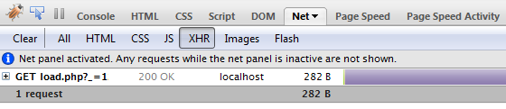
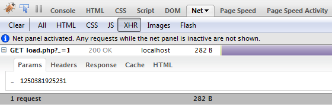
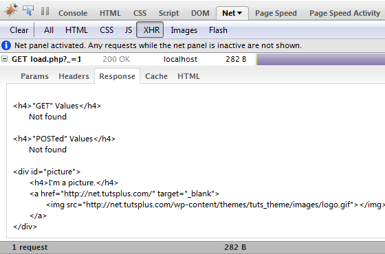
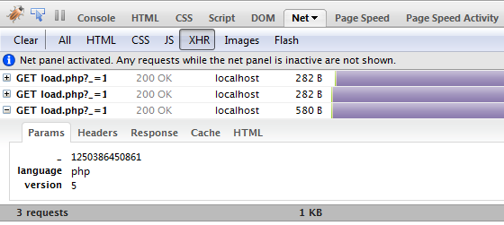
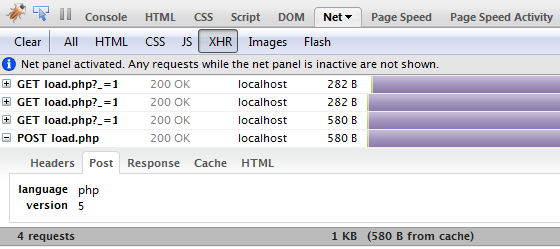

# Ajax


## JSON
- JavaScript Object Notation
- Se utiliza para almacenar e intercambiar información
- Más pequeño que XML y más rápido y sencillo de analizar (parsear).
- Se basa en la sintaxis del propio JavaScript para objetos. 

```
//Objeto JSON:
{ "nombre":"Pepe" , "apellido":"Pérez" }
```


- Otros ejemplos:
```
//Array JSON
{
"estudiantes": [
    { "nombre":"Juan" , "lastName":"Alcocer" }, 
    { "nombre":"Ana" , "lastName":"Serrano" }, 
    { "nombre":"Mario" , "lastName":"Gil" }
  ]
}
//sintáxis en JavaScript:
var estudiantes = [
    { "nombre":"Juan" , "lastName":"Alcocer" }, 
    { "nombre":"Ana" , "lastName":"Serrano" }, 
    { "nombre":"Mario" , "lastName":"Gil" }
  ];
```


## ¿Qué es AJAX?
- AJAX quiere decir Asynchronous JavaScript and XML.
- Sirve para cargar datos en background y mostrarlos en la web sin necesidad de recargar la página, por eso lo de asíncrono.
- XHR significa XML HTTP REQUEST y es hablar de lo mismo. 
- Lo podemos ver en el inbox de gmail, en google maps cuando aplicamos el zoom, etc.
- jQuery y AJAX:
  -La implementación de AJAX es distinta en función del navegador.
  - Podremos recibir ficheros de tipo texto, XML, html o JSON mediante http GET o POST.


- Cachear AJAX
```
$.ajaxSetup ({  
    cache: false  
});  
```
- Será útil usar caché solamente con contenidos estáticos.
- Es aconsejable indicarlo porque el comportamiento por defecto puede variar en función del navegador.
- La caché solo funciona mediante GET.


## Método load
- Es el método más sencillo. Lo usaremos para cargar cierto contenido por AJAX al DOM de la página actual.
```
$(selector).load(URL,data,callback);
```
- Se puede especificar un selector jQuery a la URL:
```
$("#div1").load("demo_test.txt #p1");
```


**Ejemplo de uso**
- Petición de contenido vía ajax al pulsar un enlace:

```
 <html>
<head>
   <title>Ajax Simple</title>
<script src="jquery-1.8.2.min.js" type="text/javascript"></script>   
<script>
$(document).ready(function(){
   $("#enlaceajax").click(function(evento){
      evento.preventDefault();
      $("#destino").load("contenido-ajax.html");
   });
})
</script>
</head>
<body>

<a href="#" id="enlaceajax">Haz clic!</a>
<br>
<div id="destino"></div>

</body>
</html>
```


### Seleccionar datos en petición AJAX
- Podemos añadir un selector jQuery a nuestra URL de petición AJAX:
```
$("#div1").load("mipagina.html #p1");
```
- En este caso obtendremos del fichero mipagina.html el elemento identificado con id="p1".


**Paso de parámetros**
- El método load puede llevar parámetros o una función de callback:
```
$(document).ready(function(){
   $("#enlaceajax").click(function(evento){
      evento.preventDefault();
      $("#destino").load("recibe-parametros.php", {nombre: "Pepe", edad: 45}, function(){
         alert("recibidos los datos por ajax");
      });
   });
})
```


- Fichero en php:
```
Recibido el siguiente dato:
<br/>
Nombre: <?php echo $_POST["nombre"];?>
<br/>
Edad: <?php echo $_POST["edad"];?>
```
**Con mensaje de "carga"**
```
$(document).ready(function(){
   $("#enlaceajax").click(function(evento){
      evento.preventDefault();
      var ajax_load = "";  
      var loadUrl = "pagina_lenta.php";  
      $("#result").html(ajax_load).load(loadUrl);  
   });
})
```


- Fichero en php:
```
<?php
sleep(3);
echo ("He tardado 3 segundos en ejecutar esta p&aactute;gina...");
?>

```
$(selector).load(URL,data, callback);
```
- El parámetro opcional de callback especifica la función de callback a ejecutar cuando el método load() se haya completado. Puede tener varios parámetros:
  - responseTxt - contiene el resultado de la llamada si ha sido un éxito
  - statusTXT - contiene el estado de la llamada
  - xhr - contiene el objeto XMLHttpRequest
- Ejemplo de uso:
```
$("button").click(function(){
  $("#div1").load("demo_test.txt",function(responseTxt,statusTxt,xhr){
    if(statusTxt=="success")
      alert("External content loaded successfully!");
    if(statusTxt=="error")
      alert("Error: "+xhr.status+": "+xhr.statusText);
  });
});
```


## Otros métodos
- **$.getJSON()**: Obtiene un fichero JSON de un sitio remoto
- **$.getScript()**: Obtiene un fichero javascript de un sitio remoto
- **$.get()**: hace peticiones ajax vía GET 
- **$.post()**: hace peticiones ajax vía POST
- **$.ajax()**: De más bajo nivel. Será útil para controlar errores en las peticiones AJAX o alguna función específica de AJAX (por ejemplo la cache).


## Ajax y Firebug
- Podemos hacer un seguimiento de las peticiones Ajax desde la pestaña de Red de Firebug, opción XHR (XML HTTP REQUEST):



- Si pulsamos en el recuadro del + a la izquierda, podremos ver los parámetros que se envían en la petición AJAX. En esta petición no hay ningún parámetro. El único que hay es un número aleatorio generado para forzar que la petición no se sirva de la caché.



- En la pestaña de respuesta (response) encontramos lo que devuelve la petición AJAX:



- En este caso enviamos más de un parámetro vía GET. Para pasar más de un parámetro:
```
	$("#load_get").click(function(){
		$("#result")
			.html(ajax_load)
			.load(loadUrl, "language=php&version=5");
	});
```



- Si pasamos los parámetros como un objeto en vez de como una cadena, se enviarán vía POST:
```
	$("#load_post").click(function(){
		$("#result")
			.html(ajax_load)
			.load(loadUrl, {language: "php", version: 5});
	});
```



